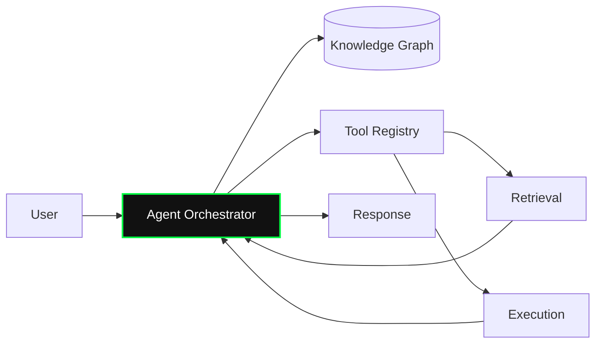

---
# ============================================================================
# Required + optional front matter for the create-presentation skill.
# Delete any optional key you don't need; do NOT leave empty values.
# ============================================================================
slug: my-talk-slug                          # required (or auto-derived from filename) — folder name + data-deck-slug, kebab-case
title: My Talk Title Goes Here              # required — cover slide title
subtitle: A concise subtitle that frames it # optional — cover subtitle
abstract: One-sentence pitch shown on the   # optional — hub card description (falls back to subtitle)
  presentations hub card.
date: 2026-05-04                            # optional — ISO-8601, shown on cover footer + hub card
venue: IEEE ComSoc Ottawa                   # optional — shown on cover footer + hub card
duration: 30 min                            # optional — shown on hub card
tags: [AI Systems, Agentic AI, Edge]        # optional — array of strings, rendered as pills
cover: ./images/cover.png                   # optional — hub card thumbnail (local path or URL)
pdf: ./pdfs/my-talk.pdf                     # optional — surfaces a "[ pdf ↓ ]" link on the hub card
---

<!-- ============================================================================
     2 · HOOK — earn attention with one strong idea.
     Pick ONE of the two patterns below. *…* renders as glowing green emphasis.
     The second paragraph (if present) becomes a fragment that reveals on press.
     ============================================================================ -->

::: hook
What if every **agentic system** we ship today is built<br>
on the *wrong abstraction*?

The next 25 minutes argue it is — and show what to do about it.
:::

<!-- Alternate hook — dominant statistic. Delete the block above if you use this.

::: hook stat=42×
slower than humans on this task — today
:::
-->

<!-- ============================================================================
     3 · PROMISE — what the audience walks away with.
     Each bullet reveals on press by default; the [fragment] markers are explicit.
     ============================================================================ -->

::: promise
- [fragment] A **vocabulary** for thinking about the problem precisely
- [fragment] A **reference architecture** you can adopt this quarter
- [fragment] The **three failure modes** we hit so you don't have to
:::

<!-- ============================================================================
     4+ · BODY — sections (`#`) and content slides.
     Every standalone H1 (`#`) becomes a section divider with auto-numbered
     // 01, // 02, …  Every H2 (`##`) starts a new content slide.
     ============================================================================ -->

# Background

The status quo is X. It works in the lab and stops working in production.

A short paragraph or two of context lives here. Anything outside a `:::` block
or fenced code becomes a default content slide.

## Where it breaks

- First failure mode
- [fragment] Second failure mode (revealed on press)
- [fragment-highlight] Third failure mode (reveals with a green pulse)

<!-- ----- Two-column layout -----
     Add `split=60-40` or `split=40-60` to bias the columns.
     The `---` line inside the block separates left from right. -->

::: two-col split=60-40
### What's broken today
- Painful constraint #1
- Painful constraint #2
- Painful constraint #3

---

### Why now
The enabling shift that makes this solvable in 2026.

> 10× improvement, 42% cost ↓
:::

<!-- ----- Pull-quote (the line starting with `—` becomes the cite) ----- -->

::: quote
Architecture is the decisions you wish you could get right early in a project,
but that you are not necessarily more likely to get right than any other.

— Ralph Johnson
:::

# Architecture

<!-- ----- Mermaid diagram (auto-rendered, included in PDF export) ----- -->



<!-- ----- Code (auto-highlighted by language tag — use `python`, not `{python}`) ----- -->

```python
from anthropic import Anthropic

client = Anthropic()

def run_agent(task: str) -> str:
    messages = [{"role": "user", "content": task}]
    while True:
        resp = client.messages.create(
            model="claude-opus-4-7",
            max_tokens=4096,
            tools=TOOLS,
            messages=messages,
        )
        if resp.stop_reason == "end_turn":
            return resp.content[-1].text
        messages.append({"role": "assistant", "content": resp.content})
        messages.append({"role": "user", "content": run_tools(resp)})
```

# Demo & Results

<!-- ----- Full-bleed image slide. `caption` is optional. ----- -->

::: image src=./images/dashboard.png caption=System dashboard during the live demo
:::

<!-- ----- Video slide. .mp4/.webm → <video controls>; anything else → <iframe>. ----- -->

::: video src=https://www.youtube.com/embed/VIDEO_ID caption=Live demo walk-through
:::

<!-- ----- PDF / live-demo embed (replaced with a printable placeholder in PDF export). -->

::: embed src=./pdfs/whitepaper.pdf
:::

<!-- ----- Standard markdown table — renders as a styled results table. ----- -->

| Configuration       | Latency (ms) | Accuracy | Notes              |
|---------------------|-------------:|:--------:|--------------------|
| Baseline            | 340          | 0.71     | Reference run      |
| + Knowledge Graph   | 290          | 0.84     | +13 pts accuracy   |
| + Agentic loop      | 410          | **0.92** | Best result        |

<!-- ============================================================================
     N-1 · WRAP — the single thing to remember.
     Uses the hook style for visual symmetry with the opening.
     ============================================================================ -->

::: wrap
Pick the abstraction *before* the framework.<br>
Everything else is replaceable.
:::

<!-- ============================================================================
     N · END / Q&A — auto-added if you omit this block. Override only if you
     want non-default contact info.
     ============================================================================ -->

::: end
- iabualhaol@gmail.com
- linkedin.com/in/abualhaol/
- alhaol.github.io
:::

<!-- ============================================================================
     CHEATSHEET
     ----------------------------------------------------------------------------
     Slide blocks         ::: hook | ::: hook stat=42× | ::: promise |
                          ::: two-col [split=60-40|split=40-60] |
                          ::: quote | ::: image | ::: video | ::: embed |
                          ::: wrap | ::: end
     Section divider      A standalone H1 line          # Background
     Content slide        Anything outside a typed block (auto-split on H2)
     Fragments            Prefix bullet/block with [fragment] or [fragment-highlight]
     Inline emphasis      *text* inside hook/wrap → green glow;  **text** → bold
     Local assets         ./images/foo.png  ./pdfs/foo.pdf  (skill copies + rewrites)
     Remote assets        Full http(s) URLs are kept verbatim.
     Don'ts               ::: with 4 colons; {python} language tags;
                          # heading inside a ::: block; mermaid w/ leading blank lines.
     ============================================================================ -->
