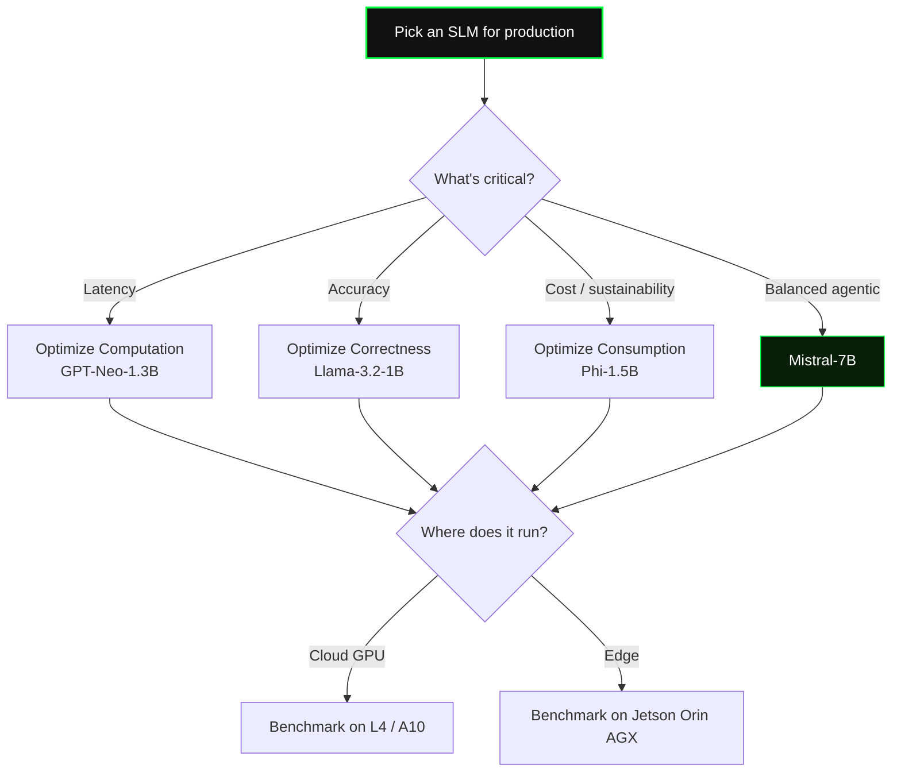

::: hook stat=3×
more energy consumed by the most accurate SLM than by the most efficient one.

We're optimizing for one axis of a three-axis problem.
:::

::: promise
- [fragment] A **vocabulary** — correctness, computation, consumption
- [fragment] A **selection matrix** — which model for which workload
- [fragment] A **deployment principle** — hardware-aware, sustainability-conscious
:::

# The Three Axes

::: two-col split=40-60
### Three dimensions
- **Correctness** — accuracy, F1, BLEU
- **Computation** — runtime, FLOPs
- **Consumption** — kWh, CO₂, $

---

### One question, three answers
Optimizing for a single dimension produces systems that are *expensive to run*, *slow to respond*, or *environmentally indefensible at scale*.

> SLM-Bench (Pham et al., EMNLP 2025) measures all three across 15 models, 23 datasets, 4 hardware configurations.
:::

## Who wins on which axis

| Axis | Winner | Energy (kWh / 1k tokens) |
|---|---|---|
| Correctness | **Llama-3.2-1B** | 0.0362  ⚠ highest |
| Computation | **GPT-Neo-1.3B** | mid |
| Consumption | **Phi-1.5B** | **0.0136**  ★ |
| Balanced | **Mistral-7B** | 0.0351 |

The most accurate model is the worst on energy. The relationship between size and energy is not linear — *architecture matters as much as scale*.

::: quote
Although computation and energy consumption are often correlated, they are not equivalent. Some models use more energy to achieve faster runtimes.

— SLM-Bench, Pham et al. (EMNLP 2025)
:::

# Hardware Changes Everything

## The selection matrix

| Workload | Priority | Candidate |
|---|---|---|
| Latency-critical (UX agents) | Computation | GPT-Neo-1.3B |
| Accuracy-critical (QA, NER) | Correctness | Llama-3.2-1B |
| Cost / sustainability | Consumption | **Phi-1.5B** |
| General agentic orchestration | Balance | Mistral-7B |

> Don't pick from a leaderboard. **Benchmark on the hardware where the model will actually run.** A 2× efficiency gap between cloud and edge measurements is common.

# Sustainability Is Not Optional

Strubell et al. (2019) found that training one large NLP model emits CO₂ equivalent to **five cars over their lifetimes**.

But for always-on agentic systems, **inference dominates within months** — millions of requests per day, each drawing energy.

The tools to measure exist:
- `ML-CO2 Impact`
- `Zeus` energy monitoring
- `LLMCarbon` (Faiz et al., ICLR 2024)

Measurement is reproducible. *Using it is professional responsibility.*

::: wrap
Measure all *three* axes — **before** you commit. 
The trilemma doesn't disappear by ignoring two of them.
:::
